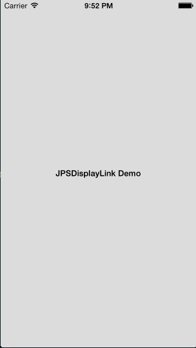

# JPSDisplayLink

JPSDisplayLink provides an easy, block interface to CADisplayLink-based animations.

This is ideal for animating properties that don't support UIView-based animations like font size on a UILabel or UITextView.

## Installation

### From CocoaPods

Add `pod 'JPSDisplayLink'` to your Podfile.

### Manually

_**Important note if your project doesn't use ARC**: you must add the `-fobjc-arc` compiler flag to `JPSDisplayLink.m` in Target Settings > Build Phases > Compile Sources._

Drag the `JPSDisplayLink/JPSDisplayLink` folder into your project.

## Usage

JPSDisplayLink only has one class method:

```objective-c
typedef void (^JPSDisplayLinkBlock)(CGFloat progress);

+ (void)runDisplayLinkBlock:(JPSDisplayLinkBlock)block duration:(CFTimeInterval)duration;
```

A JPSDisplayLink object will be created and implicitly retained for the duration specified, then it is automatically released.

_**Make sure you follow proper block etiquette when using JPSDisplayLinkBlock**: for example, avoid retain cycles._

### Demo

See sample Xcode project in `/JPSDisplayLinkDemo`.

Here's a GIF of the demo app in action. Note that the GIF's framerate is much slower than in reality.



## License

This project is under the MIT license.
